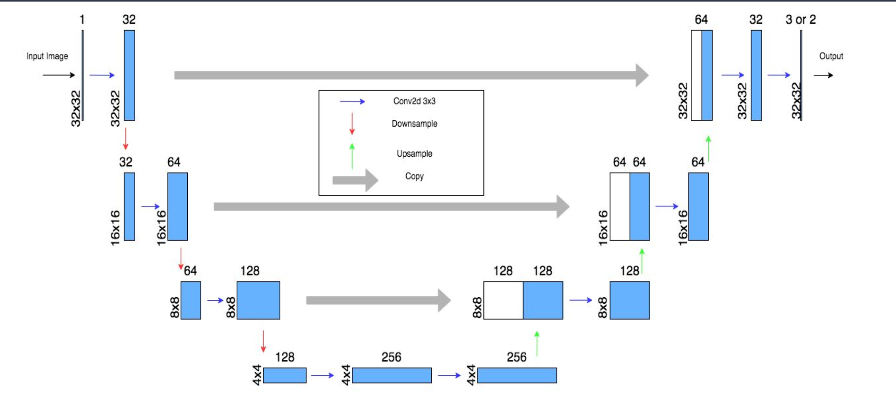
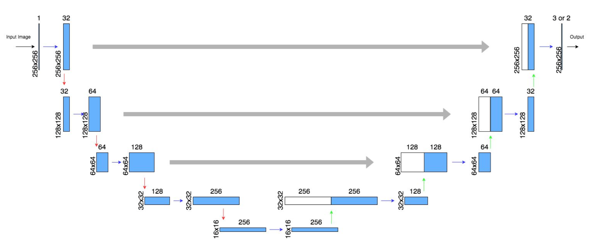
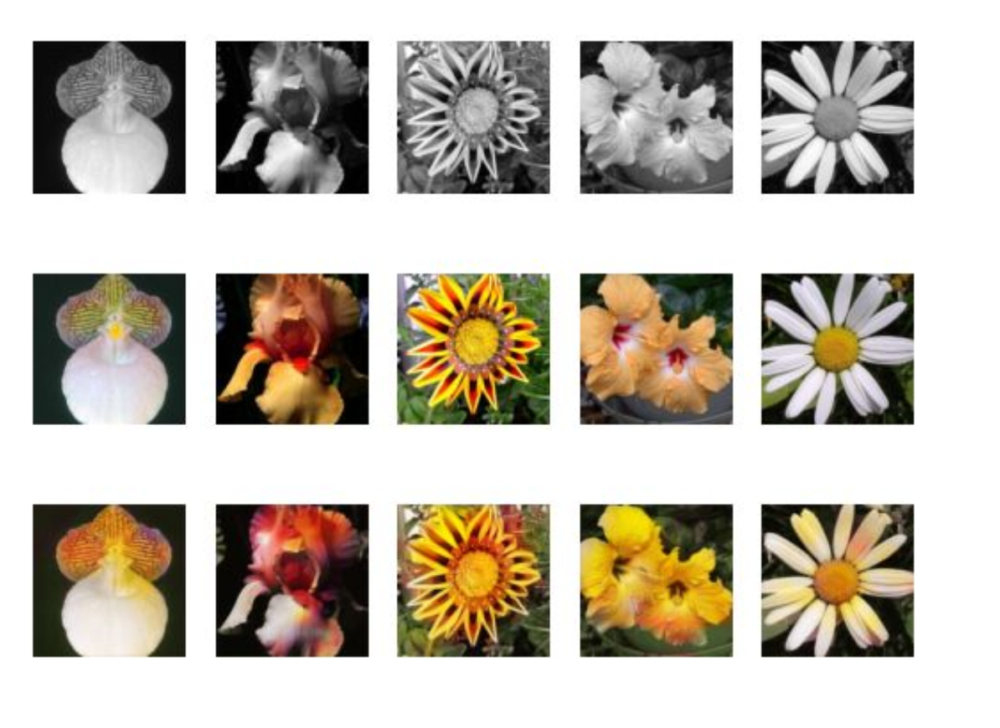
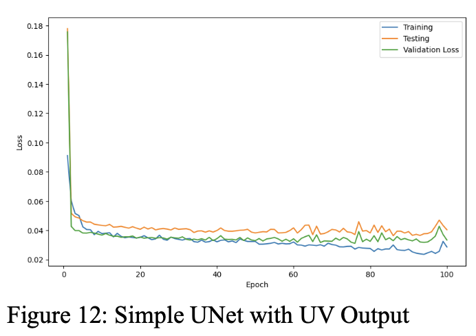
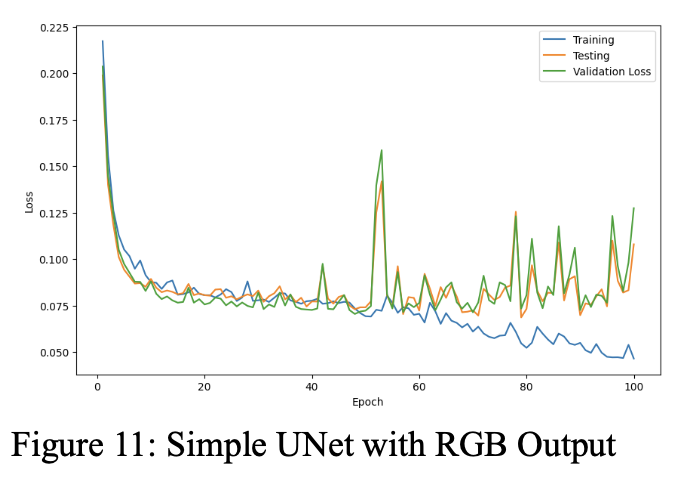
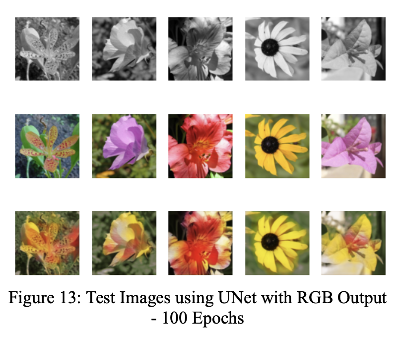
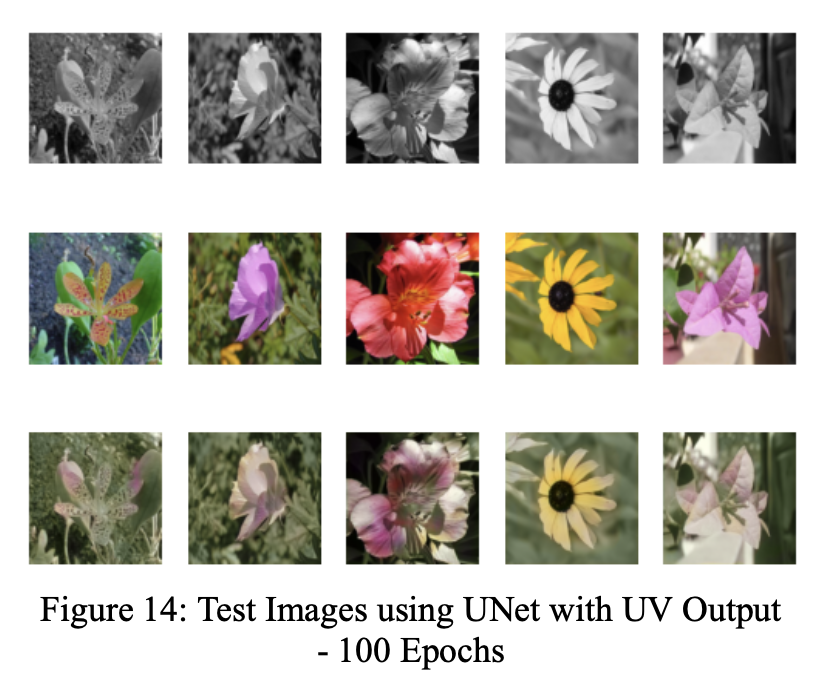

# Grayscale Image Colorization using UNet Variations

## Abstract
In this project, we present adapted UNet implementations for the task of grayscale image colorization, applied to the CIFAR10 and Flower102 datasets. We proposed two variations of the UNet architecture with different upsampling and downsampling techniques. Despite achieving similar loss values on both datasets, the models trained on the Flower102 dataset produced superior visual results compared to those trained on the CIFAR10 dataset.

## Design Details
Our models are based on the UNet architecture, a convolutional neural network commonly used in image segmentation tasks, adapted here for image colorization. The network consists of a symmetric structure with a contracting path for capturing local image context and an expansive path for restoring color information. This architecture is well-suited for the task of image colorization due to its ability to effectively capture and condense features, followed by a detailed reconstruction of the image.

### UNet Architecture for CIFAR10 Dataset

### UNet Architecture for Flower102 Dataset

To accommodate the larger image size of the Flower102 dataset (256x256), we modified the UNet architecture with an additional layer of downsampling and upsampling. This allowed the model to extract more detailed features necessary for better colorization results.

## Results and Observations

### Visual Results

#### UNet with RGB Output

#### UNet with UV Output

#### Test Images using UNet with RGB Output - 100 Epochs

#### Test Images using UNet with UV Output - 100 Epochs

## Conclusion
This project demonstrates that while UNet variations can achieve similar numerical performance across different datasets, the visual quality of the colorization results can vary significantly. The Flower102 dataset, with its consistent patterns and object types, proved to be more suitable for image colorization tasks, delivering superior visual outcomes compared to the CIFAR10 dataset.

## References
- [UNet Architecture Paper](https://arxiv.org/abs/1505.04597)
- Dataset sources: [CIFAR10](https://www.cs.toronto.edu/~kriz/cifar.html), [Flower102](https://www.robots.ox.ac.uk/~vgg/data/flowers/102/)
